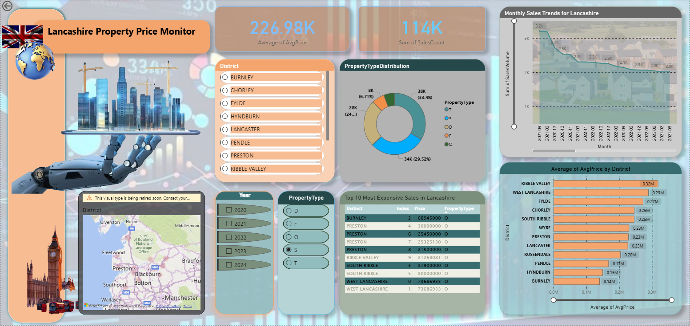

# Lancashire Property Price Monitor – SQL & Power BI Dashboard  

 End-to-end data analytics workflow for property price analysis in Lancashire (2020–2024).  

---

##  Project Overview  
This project demonstrates how raw government datasets (UK Price Paid Data) can be transformed into actionable insights using **SQL Server** for data engineering and **Power BI** for interactive visualization.  

The dashboard enables exploration of:  
- Average property prices by district  
- Property type distribution  
- Monthly sales trends  
- Top 10 most expensive transactions  

---

##  Features  
- **Database Design**: Structured SQL Server database (`LancashirePropertyDB`) with raw and cleaned tables.  
- **Data Cleaning & Transformation**: Bulk inserts, type conversions, handling NULLs, staging tables.  
- **Analysis Views & Procedures**:  
  - Property type distribution by district  
  - Monthly sales trends  
  - Top 10 most expensive transactions  
  - Average property prices by district  
- **Interactive Power BI Dashboard**: Dynamic filters (district, property type, year) and visual storytelling.  

---

##  Tech Stack  
- **SQL Server** – database design, bulk import, cleaning, stored procedures  
- **Power BI** – dashboard design, interactive visuals, reporting  
- **Excel** – validation and row count checks  

---

## Key Insights  
- Ribble Valley recorded the highest average property prices (~£313K).  
- Burnley and Hyndburn showed the lowest averages (~£145K).  
- Clear monthly sales trends with COVID-19 impact visible in 2020.  
- Identified top transactions exceeding £70M across districts.  

---

##  Future Extensions  
- Regression model building for price prediction  
- Forecasting property trends for 2025  
- R Shiny app integration for web-based analytics  

---

##  Installation & Usage  

### 1. Clone the repository  
```bash
git clone https://github.com/your-username/lancashire-property-price-monitor.git


## 📸 Dashboard Preview

### Dashboard Overview
  
*Figure 1: Full dashboard layout showing filters and summary cards*
